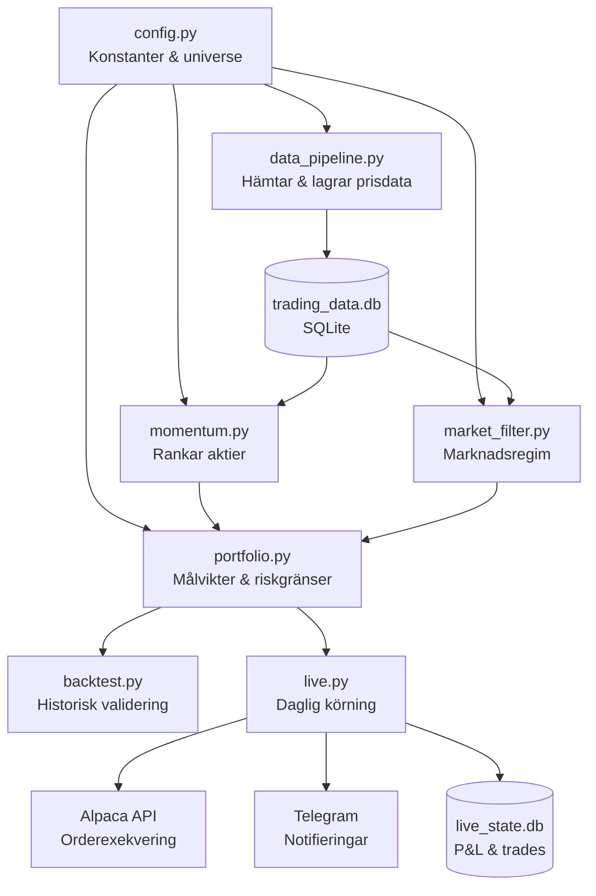
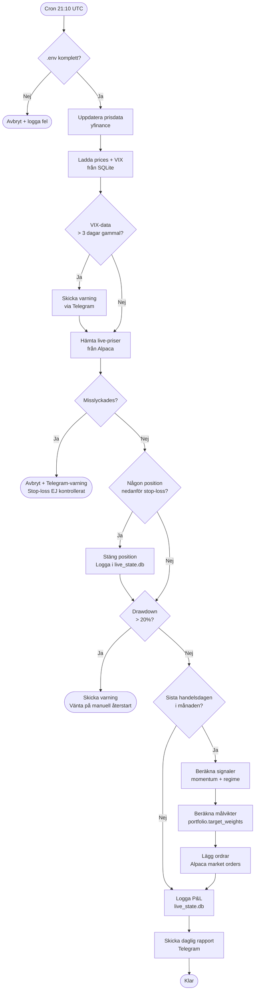
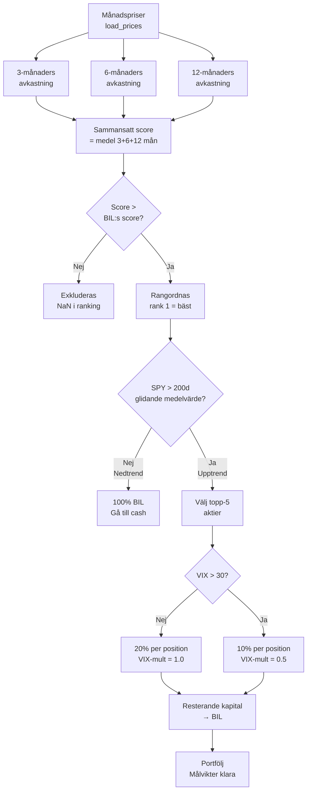
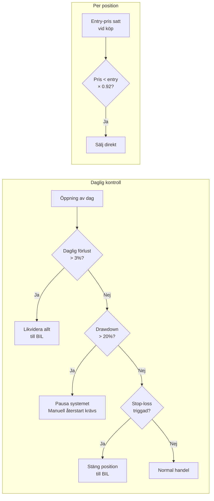
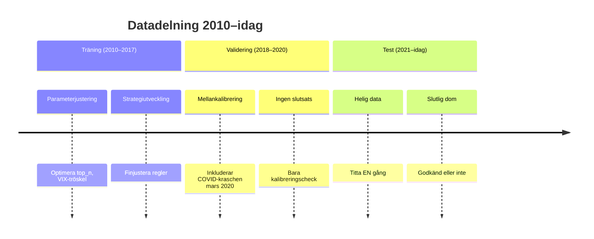
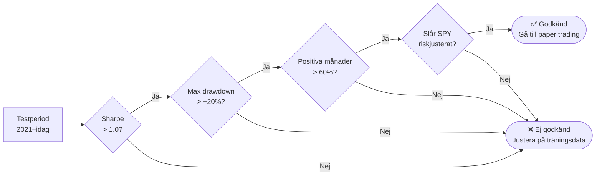

# Systemarkitektur — Dual Momentum Trading Bot

## 1. Modulöversikt

---

## 2. Daglig körning (live.py)

---

## 3. Portföljbeslut — från signal till position

---

## 4. Riskhantering — dagliga gränser

---

## 5. Backtesting — datadelning och valideringsgates

**Valideringskrav för att gå vidare till paper trading:**

